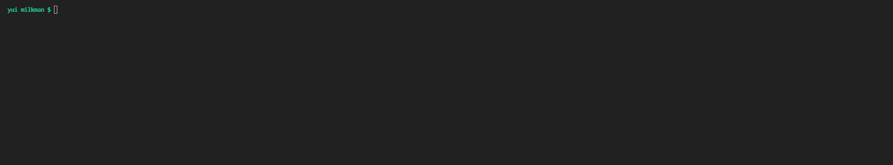

# milkman

[](https://github.com/nhomble/milkman/actions/workflows/node.js.yml)
[](https://github.com/nhomble/milkman/actions/workflows/codeql-analysis.yml)



cli driven http tester

## Usage

```
index.js <cmd> [args]

Commands:
  index.js discover [directory]             discover milk resources in
  [environment]                             [directory] and filter optionally
                                            against [environment]
  index.js run [directory] [environment]    run milk in [directory] and filter
                                            optionally against [environment]

Options:
      --version  Show version number                                   [boolean]
  -h, --help     Show help                                             [boolean]
```

## Features

- all http methods supported by `axios`
- `mustache` templating
- scripts defined between requests
- loose dependency tree via the `dependsOn` parameter
- a `test` function available in script invocations
- context passing `Map<string, any>` across specs
- filtering resources by `metadata.labels.environment`

## Development

Run the examples locally!

```sh
cd integration/
docker-compose up -d
cd -
yarn build
yarn local run examples/wiremock
```
